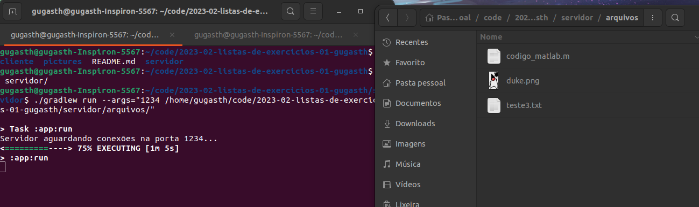
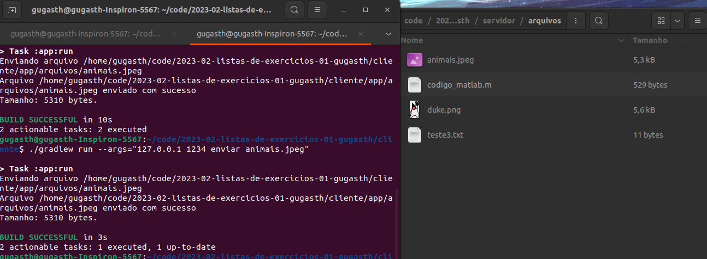
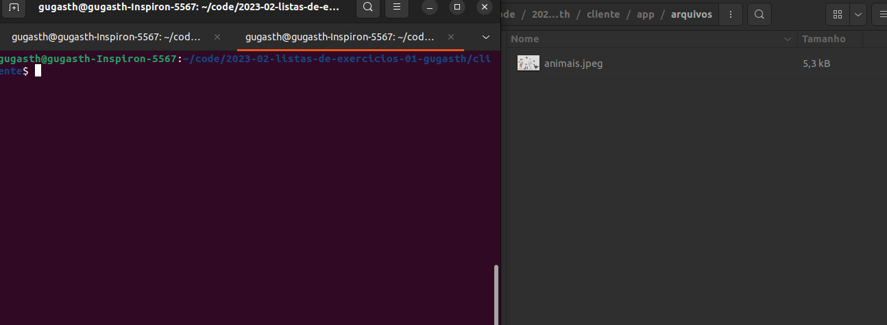
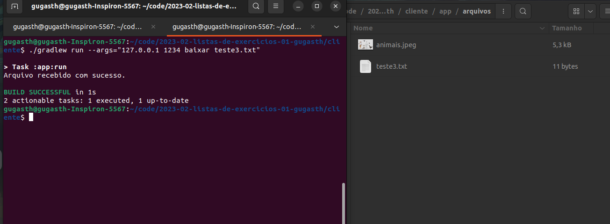

Esse projeto foi desenvolvido por mim durante a disciplina de Sistemas distribuídos da Engenharia de Telecomunicações (em 2023/2), ele permite a transferência de arquivos entre um app cliente e um app java através da utilização de sockets.

### Funcionalidades Implementadas
 - Transferência de arquivos de tamanho arbitrário entre os processos cliente e servidor pela rede TCP/IP.
 - O servidor é capaz de atender múltiplos clientes.
 - Argumentos da linha de comando, conforme especificado.
 - Cliente pode baixar um arquivo existente no servidor.
 - Cliente pode enviar um arquivo para o servidor. 


### Protocolo de aplicação
Este projeto utiliza um protocolo de aplicação baseado em sockets TCP para permitir a transferência de arquivos entre um cliente e um servidor. O protocolo é baseado em texto e envolve as seguintes operações:

O cliente pode solicitar o envio de um arquivo para o servidor usando a operação "enviar". O cliente fornece o nome do arquivo que deseja enviar. 

O cliente pode solicitar o download de um arquivo do servidor usando a operação "baixar". O cliente fornece o nome do arquivo que deseja baixar. 

Os argumentos de porta, endereço IP, diretorio e arquivos são configuráveis pelo usuário ao executar o cliente e o servidor. Isso permite que os usuários escolham a porta e o endereço IP de acordo com suas necessidades.

### Exemplos de utilizaçao
O comando a seguir é um exemplo de início do servidor, abrindo a porta 1234 e informando um diretório.
```bash
./gradlew run --args="1234 /home/gugasth/code/2023-02-listas-de-exercicios-01-gugasth/servidor/arquivos/"
```

O comando a seguir é um exemplo de início do cliente, conectando em uma ip, em uma porta, operação desejada(baixar/enviar) e informando o arquivo para realizar a operação.
### Cliente
```bash
./gradlew run --args="127.0.0.1 1234 baixar teste3.txt"
```

Na primeira captura de tela é possível observar o servidor sendo iniciado, abrindo a porta 1234 e configurando um diretório. Na parte da direita, é possível ver o diretório escolhido.


Na captura de tela a seguir, é possível ver o cliente enviando o arquivo "animais.jpeg" para o servidor, e na pasta a direita o arquivo aparecendo.


Nessa terceira captura de tela, podemos observar o diretório do cliente que tem apenas uma foto.


A seguir, o cliente baixa o arquivo "teste3.txt" do servidor, então é possível visualizar o arquivo aparecendo no diretório.



Obs: o diretório do cliente, foi implementado por default em /cliente/app/arquivos
